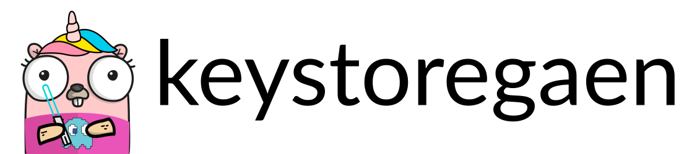
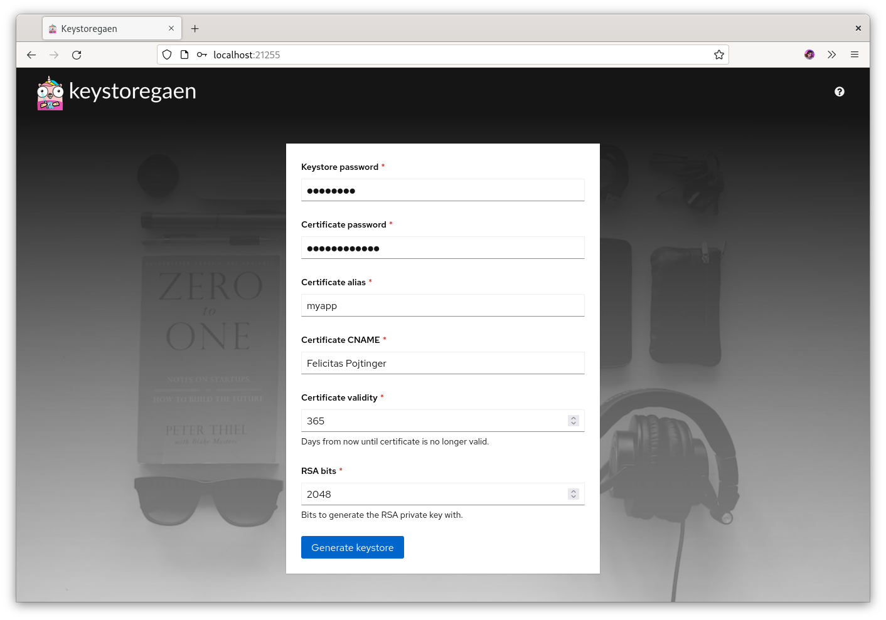
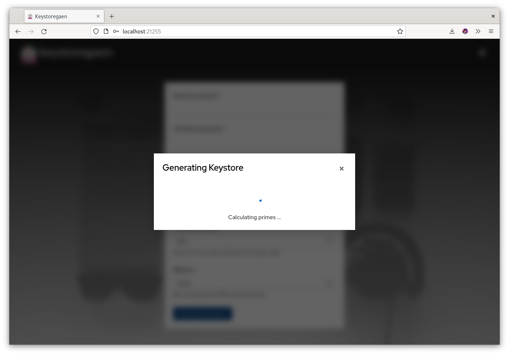

# keystoregaen



Generate Java keystores in your browser.

[](https://github.com/pojntfx/keystoregaen/actions/workflows/hydrun.yaml)

[](https://pkg.go.dev/github.com/pojntfx/keystoregaen)
[](https://matrix.to/#/#keystoregaen:matrix.org?via=matrix.org)
[](https://github.com/pojntfx/keystoregaen/releases)

## Overview

keystoregaen is an app to generate Java keystores and compatible certificates without having to install Java or another tool that provides the JDK's `keytool`, such as the Android SDK.

## Installation

The web app is available on [GitHub releases](https://github.com/pojntfx/keystoregaen/releases) in the form of a static `.tar.gz` archive; to deploy it, simply upload it to a CDN or copy it to a web server. For most users, this shouldn't be necessary though; thanks to [@maxence-charriere](https://github.com/maxence-charriere)'s [go-app package](https://go-app.dev/), keystoregaen is a progressive web app. By simply visiting the [public deployment](https://pojntfx.github.io/keystoregaen/) once, it will be available for offline use whenever you need it:

[](https://pojntfx.github.io/keystoregaen/)

## Screenshots

Click on an image to see a larger version.

<a display="inline" href="./docs/initial.png?raw=true">

</a>

<a display="inline" href="./docs/filled.png?raw=true">

</a>

<a display="inline" href="./docs/generating.png?raw=true">

</a>

## Acknowledgements

- This project would not have been possible were it not for [@maxence-charriere](https://github.com/maxence-charriere)'s [go-app package](https://go-app.dev/); if you enjoy using keygaen, please donate to him!
- The open source [PatternFly design system](https://www.patternfly.org/v4/) provides the components for the project.
- [pavlo-v-chernykh/keystore-go](https://github.com/pavlo-v-chernykh/keystore-go) provides the implementation of the JKS encoder.

To all the rest of the authors who worked on the dependencies used: **Thanks a lot!**

## Contributing

To contribute, please use the [GitHub flow](https://guides.github.com/introduction/flow/) and follow our [Code of Conduct](./CODE_OF_CONDUCT.md).

To build and start a development version of keystoregaen locally, run the following:

```shell
$ git clone https://github.com/pojntfx/keystoregaen.git
$ cd keystoregaen
$ make depend
$ make run
```

Have any questions or need help? Chat with us [on Matrix](https://matrix.to/#/#keystoregaen:matrix.org?via=matrix.org)!

## License

keystoregaen (c) 2022 Felicitas Pojtinger and contributors

SPDX-License-Identifier: AGPL-3.0
